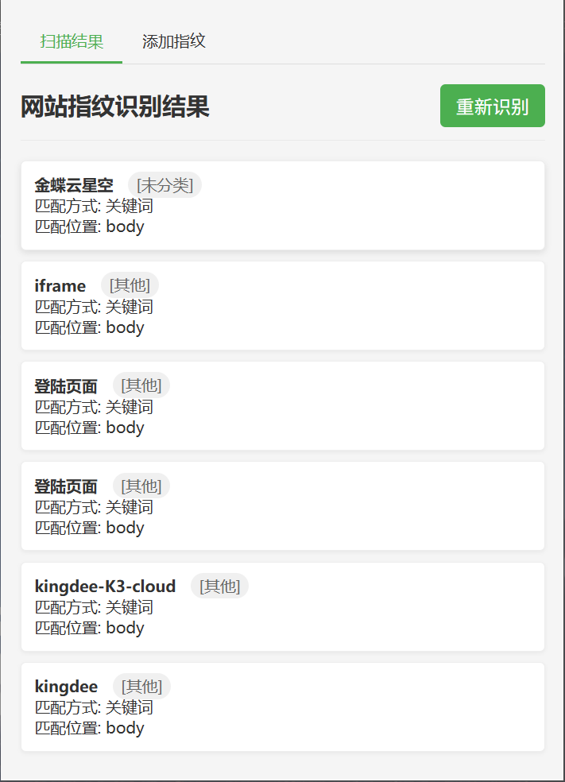
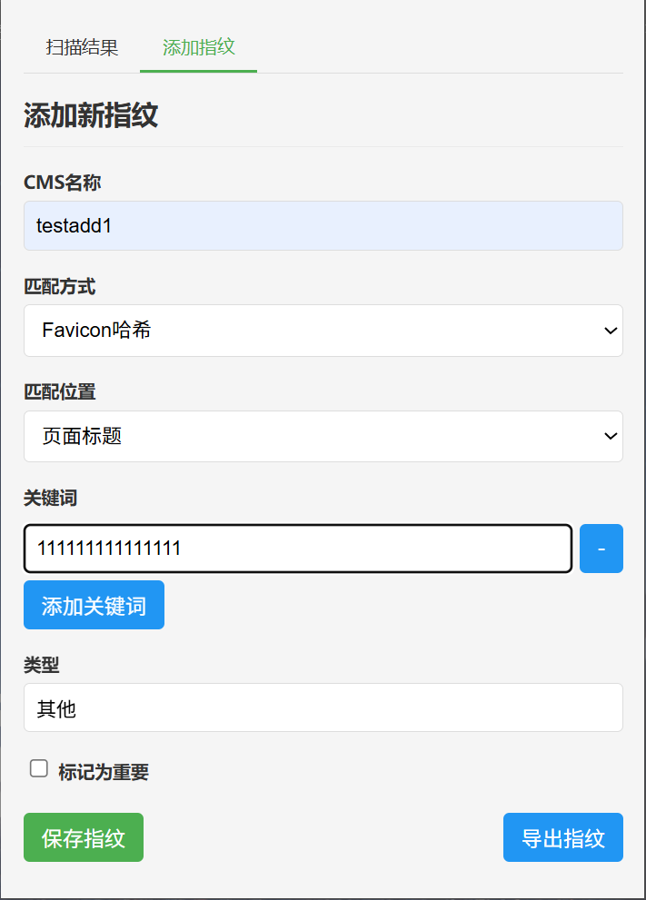
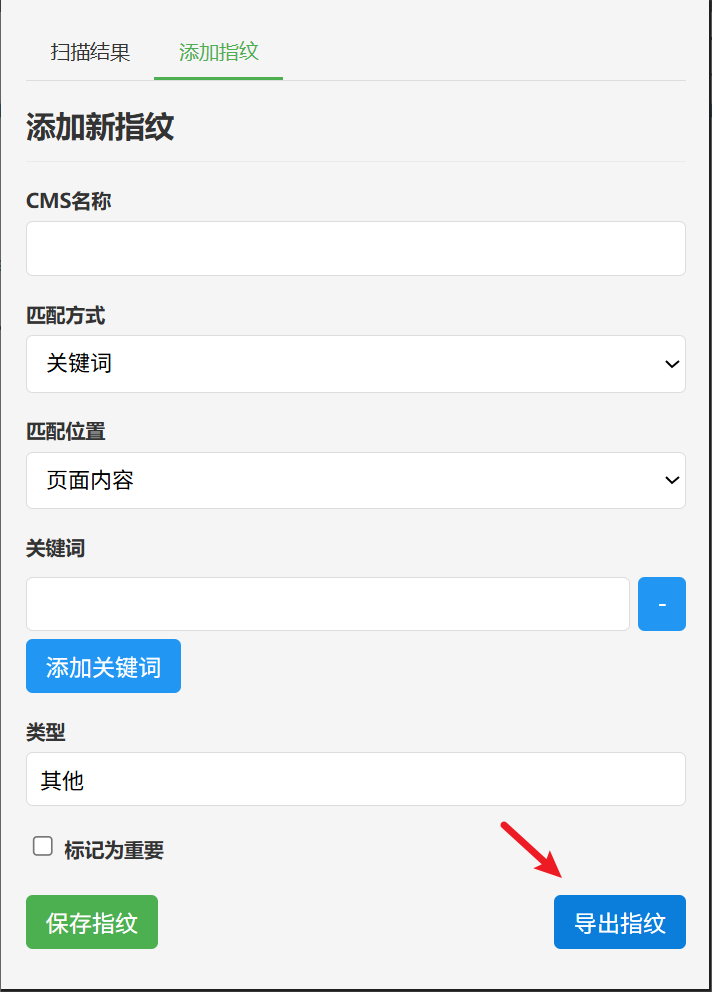
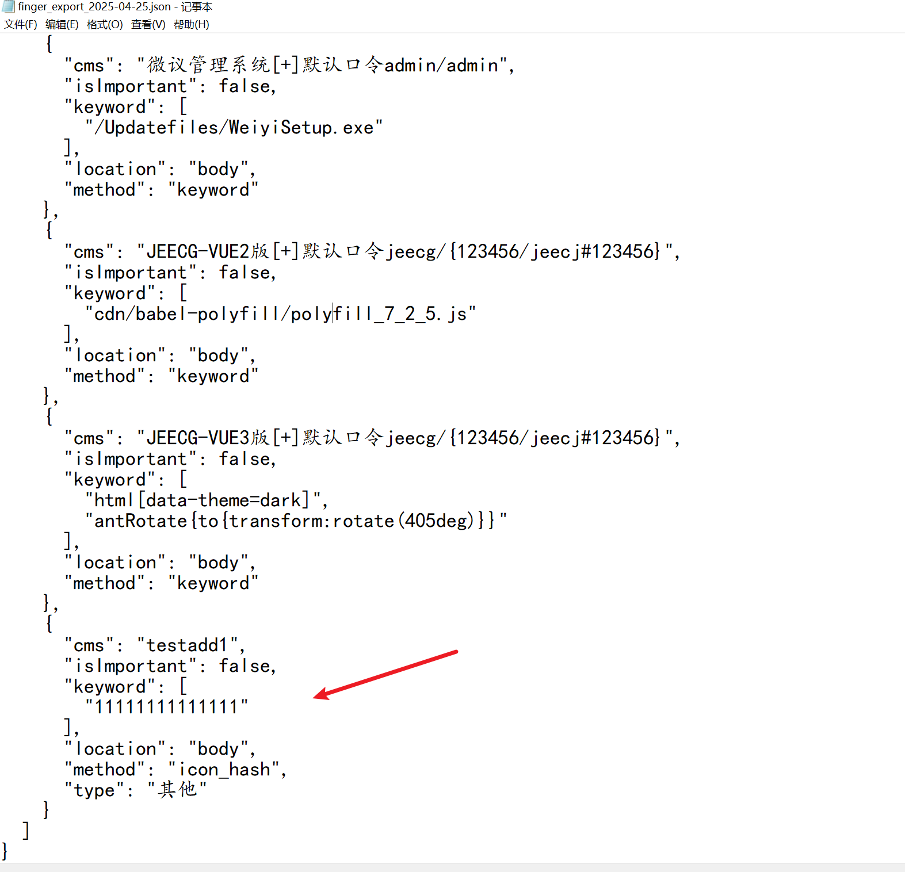

## 插件原理

1. 基本架构
- 插件采用Chrome扩展的标准架构，包含以下主要组件：
  - manifest.json : 扩展的配置文件
  - content.js : 内容脚本，负责页面分析
  - popup.html/js : 弹出界面及其逻辑
  - background.js : 后台服务脚本
  - finger.json : 内置指纹库
2. 核心功能流程
- 指纹库加载 ：
  
  - 从 finger.json 加载内置指纹库
  - 从 chrome.storage.local 加载用户自定义指纹
  - 将两者合并形成完整指纹库
- 网站识别过程 ：
  
  - 通过 checkWebsite 函数进行识别
  - 支持三种匹配位置：
    - 标题匹配（title）
    - 页面内容匹配（body）
    - HTTP头匹配（header，当前未实现）
  - 支持两种匹配方式：
    - 关键词匹配（keyword）
    - Favicon哈希匹配（icon_hash，当前为示例实现）
3. 用户界面功能
- 扫描结果页面 ：
  
  - 显示当前网站匹配到的CMS信息
  - 支持手动刷新重新扫描
  - 可导出完整指纹库
- 添加指纹页面 ：
  
  - 支持添加自定义指纹规则
  - 可配置项包括：
    - CMS名称
    - 匹配方式（关键词/Favicon哈希）
    - 匹配位置（标题/内容/HTTP头）
    - 关键词列表
    - 类型标签
    - 重要性标记
4. 数据存储
- 使用Chrome的 storage.local API存储：
  - 自定义指纹库
  - 扫描结果缓存
5. 通信机制
- 使用Chrome的消息传递机制：
  - content.js 和 popup.js 之间通过消息通信
  - 支持 GET_MATCHES 和 SCAN_PAGE 两种消息类型
  - 
## 支持的浏览器

- Google Chrome
- Microsoft Edge
  
- Quark

## 用法

### 识别指纹

### 添加指纹

### 导出指纹

## 更新日志

2025.05.30 在Finger24 1.6版本 增加Firefox版本

2025.05.23 发布Finger24 1.6版本 修复icon hash识别垃圾请求1700次的bug

2025.05.21 发布Finger24 1.5版本 增加icon hash识别

2025.05.10 发布Finger24 1.4版本 增加白名单功能，对某些网站跳过检测指纹

2025.04.25 发布Finger24 1.3版本

## 致谢
♥感谢4ESTSEC师傅提出iconhash识别函数

♥感谢Aovs师傅优化iconhash识别函数

♥感谢zR00t1的iconhash项目

♥感谢n0t5提出bug

♥感谢pplayerr提出bug

## 参考
https://github.com/zR00t1/iconhash

